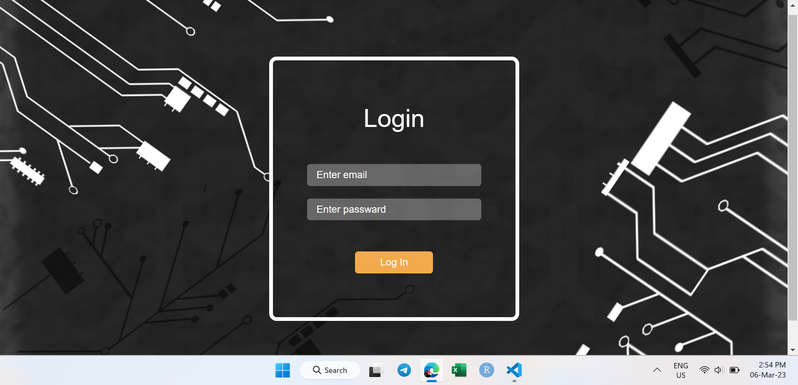
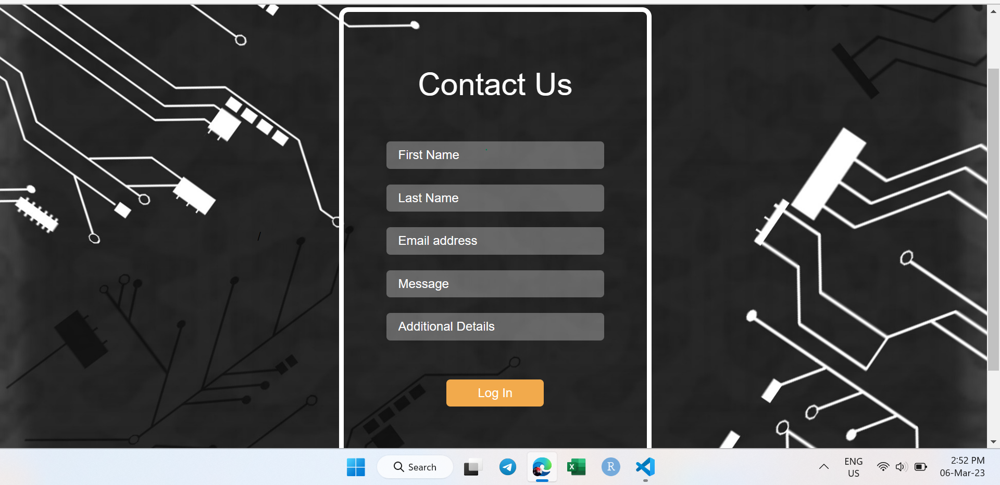
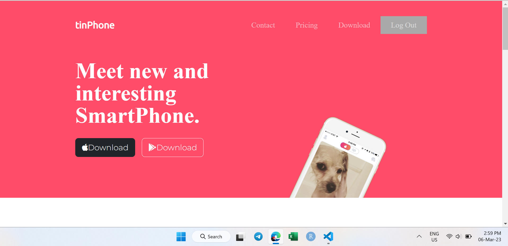
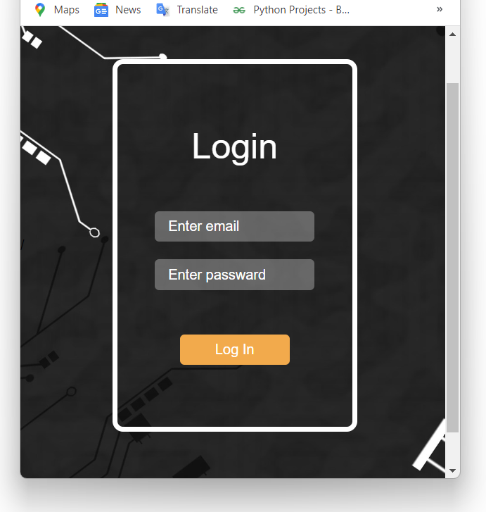
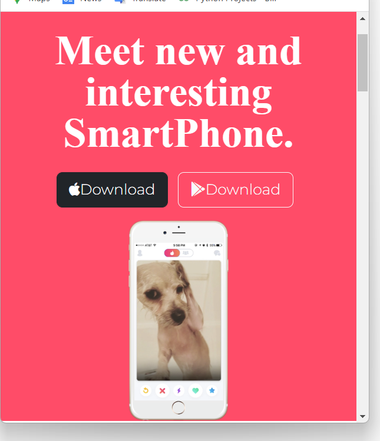
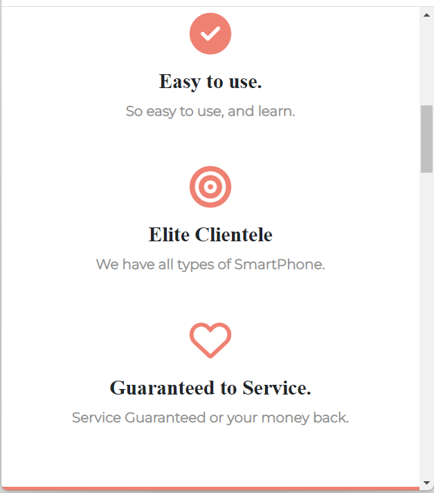

The Github Repository is currently private. It will be public by March 06 2023 11:00 pm

# TinPhone website :-

TinPhone is an website in which people who can not afford devices 
like smart phone,laptop,tablet,etc and they want to learn about 
these devices. Then you come on a right webpage in this we provide 
devices on rent and we also provide tutor.And in exchange of it we 
charge only small amount of money in exchnge of our services .

## Skill Used :-

* HTML5
* CSS3
* Javascript
* Express.js
* Node.js

## Screenshots
 ### >>>Desktop mode

1 .In intial it open Login page

2 . If user id and passward right thenit open home page other it print error.

**Home Page**

### On smart phone
. login page

. Home Page

